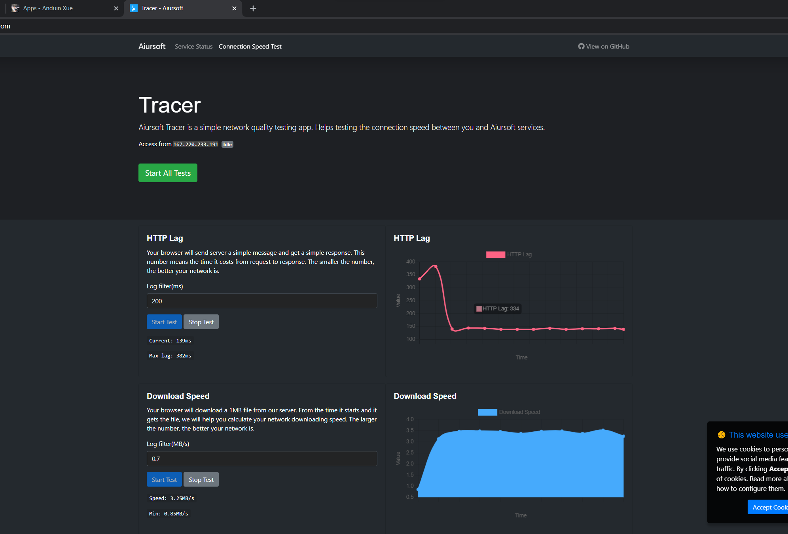

# Tracer

[](https://gitlab.aiursoft.cn/aiursoft/tracer/-/blob/master/LICENSE)
[](https://gitlab.aiursoft.cn/aiursoft/tracer/-/pipelines)
[](https://gitlab.aiursoft.cn/aiursoft/tracer/-/pipelines)
[](https://tracer.aiursoft.com)

Tracer is a simple network speed test app.

Tracer is a simple network speed test app. Deploy this on your server. Open your tracer on your browser. And you can test the speed between you and your server.



## Try

Try a running tracer [here](https://tracer.aiursoft.com).

## Run in Ubuntu

First, specify a domain name for your Ubuntu 18.04+, brand-new server.

And execute the following command in the server:

```bash
curl -sL https://gitlab.aiursoft.cn/aiursoft/tracer/-/raw/master/install.sh | sudo bash -s http://tracer.local
```

## Run locally

Requirements about how to run

1. [.NET Core runtime 6.0 or later]Execute `dotnet restore`` to restore all dotnet requirements.
2. Execute `dotnet run` to run the app
3. Use your browser to view [http://localhost:5000](http://localhost:5000)

## Run in Microsoft Visual Studio

1. Open the `.sln` file in the project path.
2. Press `F5`.

## Run in docker

Pull the container using bash:

```bash
docker pull anduin2019/tracer:1.0.0
docker run -d -p 8080:80 anduin2019/tracer:1.0.0
```

That will start a web server at `http://localhost:8080` and you can test the app.

## How to build locally in docker

Just install docker and docker-compose. Execute the following command.

```bash
docker build -t=tracer .
docker run -d -p 8080:80 tracer
```

That will start a web server at `http://localhost:8080` and you can test the app.

## How to contribute

There are many ways to contribute to the project: logging bugs, submitting pull requests, reporting issues, and creating suggestions.

Even if you with push rights on the repository, you should create a personal fork and create feature branches there when you need them. This keeps the main repository clean and your workflow cruft out of sight.

We're also interested in your feedback on the future of this project. You can submit a suggestion or feature request through the issue tracker. To make this process more effective, we're asking that these include more information to help define them more clearly.
